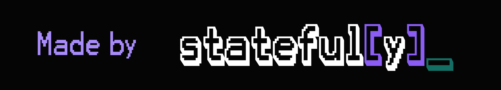

<p align="center">
  <picture>
    <source media="(prefers-color-scheme: light)" srcset="https://raw.githubusercontent.com/stateful-y/yohou-optuna/main/docs/assets/logo_light.png">
    <source media="(prefers-color-scheme: dark)" srcset="https://raw.githubusercontent.com/stateful-y/yohou-optuna/main/docs/assets/logo_dark.png">
    
  </picture>
</p>


[](https://pypi.org/project/yohou_optuna/)
[](https://github.com/stateful-y/yohou-optuna/blob/main/LICENSE)
[](https://pypi.org/project/yohou_optuna/)
[](https://anaconda.org/conda-forge/yohou_optuna)
[](https://codecov.io/gh/stateful-y/yohou-optuna)

## What is Yohou-Optuna?

An Optuna integration for hyperparameter tuning in Yohou

[Add 1-2 paragraphs explaining:
- The main problem or need this addresses
- How it works at a high level
- Key technologies or dependencies it integrates with
- Version compatibility information if relevant]

<!-- Add a screenshot showing your project in action -->


[Optional: Add version compatibility note]
<!-- Example: Currently, Yohou-Optuna supports Python 3.11+, and [dependency] versions X.Y.z -->

## What are the features of Yohou-Optuna?

- **[Feature 1 Name]**: [1-2 sentence description of this capability and why it matters. Focus on the value delivered.]
- **[Feature 2 Name]**: [1-2 sentence description emphasizing what users can accomplish with this feature.]
- **[Feature 3 Name]**: [1-2 sentence description of the capability and its benefits.]
- **[Feature 4 Name]**: [1-2 sentence description showing integration or compatibility aspects.]
- **[Feature 5 Name]**: [1-2 sentence description of advanced functionality.]
- **(Experimental) [Feature 6 Name]**: [1-2 sentence description noting this is experimental or in development.]

## How to install Yohou-Optuna?

Install the Yohou-Optuna package using `pip`:

```bash
pip install yohou_optuna
```

or using `uv`:

```bash
uv pip install yohou_optuna
```

or using `conda`:

```bash
conda install -c conda-forge yohou_optuna
```

or using `mamba`:

```bash
mamba install -c conda-forge yohou_optuna
```

or alternatively, add `yohou_optuna` to your `requirements.txt` or `pyproject.toml` file.

## How to get started with Yohou-Optuna?

### 1. [Initialize/Setup Step]

[Brief description of what this step accomplishes]

Use the following command to [describe action]:

```bash
[command to run]
```

### 2. [Configure/Customize Step]

[Brief description of what configuration does]

Define your [settings/options] in the `[config file]` located in [location]. This file allows you to [describe what user can configure].

```yaml
# [config file path]
[setting_section]:
  [setting_1]: [value]  # Comment explaining setting
  [setting_2]: [value]  # Comment explaining setting

[another_section]:
  [option_1]:
    [sub_option]: [value]

  [option_2]:
    [sub_option]: [value]
```

### 3. [Execute/Run Step]

[Brief description of how to run or execute]

[Action description] using the following command:

```bash
[command to run]
```

[Additional context about what happens when this runs, e.g., "The [interface/UI] will be available at http://127.0.0.1:XXXX"]

## How do I use Yohou-Optuna?

Full documentation is available at [https://yohou-optuna.readthedocs.io/](https://yohou-optuna.readthedocs.io/).


Interactive examples are available in the `examples/` directory:

- **Online**: [https://yohou-optuna.readthedocs.io/en/latest/pages/examples/](https://yohou-optuna.readthedocs.io/en/latest/pages/examples/)
- **Locally**: Run `marimo edit examples/hello.py` to open an interactive notebook


## Can I contribute?

We welcome contributions, feedback, and questions:

- **Report issues or request features**: [GitHub Issues](https://github.com/stateful-y/yohou-optuna/issues)
- **Join the discussion**: [GitHub Discussions](https://github.com/stateful-y/yohou-optuna/discussions)
- **Contributing Guide**: [CONTRIBUTING.md](https://github.com/stateful-y/yohou-optuna/blob/main/CONTRIBUTING.md)

If you are interested in becoming a maintainer or taking a more active role, please reach out to Guillaume Tauzin on [GitHub Discussions](https://github.com/stateful-y/yohou-optuna/discussions).

## Where can I learn more?

[Customize this section based on your project's community resources. For example:]

- Full documentation: [https://yohou-optuna.readthedocs.io/](https://yohou-optuna.readthedocs.io/)
- GitHub Discussions: [https://github.com/stateful-y/yohou-optuna/discussions](https://github.com/stateful-y/yohou-optuna/discussions)
- Interactive Examples: [https://yohou-optuna.readthedocs.io/en/latest/pages/examples/](https://yohou-optuna.readthedocs.io/en/latest/pages/examples/)

For questions and discussions, you can also open a [discussion](https://github.com/stateful-y/yohou-optuna/discussions).

## License

This project is licensed under the terms of the [Apache-2.0 License](https://github.com/stateful-y/yohou-optuna/blob/main/LICENSE).

<p align="center">
  <a href="https://stateful-y.io">
    
  </a>
</p>
