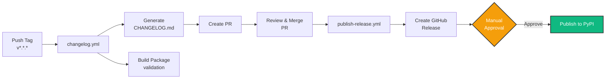

# Contributing to Yohou-Optuna

Thank you for your interest in contributing to Yohou-Optuna! This document provides guidelines for contributing to the project.

## Code of Conduct

We are committed to providing a welcoming and inclusive environment for all contributors. Please be respectful and considerate in all interactions.

## Getting Started

### Prerequisites

- Python 3.11+
- [uv](https://github.com/astral-sh/uv) (recommended)
- [just](https://github.com/casey/just) (optional, for task automation)
- Git

### Development Setup

1. Fork the repository on GitHub

2. Clone your fork:

```bash
git clone https://github.com/YOUR_USERNAME/yohou-optuna.git
cd yohou-optuna
```

3. Install dependencies:

```bash
uv sync --group dev
```

4. Install pre-commit hooks:

```bash
uv run pre-commit install
```

## Development Workflow

### Making Changes

1. Create a new branch:

```bash
git checkout -b feature/my-feature
```

2. Make your changes

3. Run tests:

=== "just"

    ```bash
    just test
    ```

=== "nox"

    ```bash
    uvx nox -s test
    ```

=== "uv run"

    ```bash
    uv run pytest
    ```

4. Format and fix code:

=== "just"

    ```bash
    just fix
    ```

=== "nox"

    ```bash
    uvx nox -s fix
    ```

=== "uv run"

    ```bash
    uv run ruff format src tests
    uv run ruff check src tests --fix
    uv run ty check src
    ```

5. Commit your changes:

```bash
git add .
git commit -m "feat: add my feature"
```

We follow [Conventional Commits](https://www.conventionalcommits.org/) for commit messages. The commit message format is enforced by commitizen pre-commit hooks, which will validate your commit messages automatically.

**Valid commit message examples:**
- `feat: add new feature`
- `fix: resolve bug in calculation`
- `docs: update installation guide`
- `chore: update dependencies`
- `test: add tests for new feature`

### Running Tests

Yohou-Optuna uses pytest with markers to categorize tests into different types:

- **Fast tests**: Unit tests that run quickly without subprocess calls or heavy I/O
- **Slow tests**: Tests marked with `@pytest.mark.slow` that take longer to execute
- **Integration tests**: Tests marked with `@pytest.mark.integration` that run subprocesses or test multiple components together

#### Test Commands

Run fast tests only (recommended during development):

=== "just"

    ```bash
    just test-fast
    ```

=== "nox"

    ```bash
    uvx nox -s test_fast
    ```

=== "uv run"

    ```bash
    uv run pytest -m "not slow and not integration"
    ```

Run slow and integration tests:

=== "just"

    ```bash
    just test-slow
    ```

=== "nox"

    ```bash
    uvx nox -s test_slow
    ```

=== "uv run"

    ```bash
    uv run pytest -m "slow or integration"
    ```

Run all tests:

=== "just"

    ```bash
    just test
    ```

=== "nox"

    ```bash
    uvx nox -s test
    ```

=== "uv run"

    ```bash
    uv run pytest
    ```

Run tests with coverage:

=== "just"

    ```bash
    just test-cov
    ```

=== "nox"

    ```bash
    uvx nox -s test_coverage
    ```

=== "uv run"

    ```bash
    uv run pytest --cov=yohou_optuna --cov-report=html
    ```

Run tests across multiple Python versions:

=== "nox"

    ```bash
    uvx nox -s test
    ```

Run example notebook tests:

=== "just"

    ```bash
    just test-examples
    ```

=== "nox"

    ```bash
    uvx nox -s test_examples
    ```

=== "uv run"

    ```bash
    uv run pytest tests/test_examples.py -m example -n auto
    ```

This runs all notebooks in the `examples/` directory as Python scripts in parallel using pytest-xdist (`-n auto`). Each notebook is executed non-interactively to validate it runs without errors.


#### When to Mark Tests as Slow or Integration

Mark your tests appropriately to help maintain fast feedback during development:

- Use `@pytest.mark.slow` for tests that:
  - Take more than a few seconds to run
  - Perform heavy computations
  - Make network requests
  - Access external resources

- Use `@pytest.mark.integration` for tests that:
  - Run subprocess commands
  - Test multiple components working together
  - Require complex setup or teardown
  - Exercise end-to-end workflows

- `@pytest.mark.example` is used in `tests/test_examples.py` to:
  - Validate example notebooks execute without errors
  - Run notebooks in the `examples/` directory
  - Test interactive documentation and tutorials


Example:

```python
import pytest

@pytest.mark.slow
def test_large_computation():
    # Long-running test
    pass

@pytest.mark.integration
@pytest.mark.slow
def test_end_to_end_workflow():
    # Complex integration test
    pass
```

#### CI Test Strategy

The CI pipeline uses a two-tier testing strategy optimized for fast feedback:

1. **Fast tests** (`test-fast` job): Runs on minimum and maximum Python versions (3.11, 3.14) only:
   - **Draft PRs**: Ubuntu only - Quick feedback in ~2-3 minutes
   - **Ready PRs/Main**: All OS - Ubuntu, Windows, macOS - Cross-platform validation

2. **Full test suite** (`test-full` job): Runs all tests (fast + slow + integration) on Ubuntu across all Python versions (3.11-3.14) when the PR is not in draft mode or on the main branch. This comprehensive validation includes coverage reporting on the minimum supported Python version.

### Code Quality

Run linters and type checkers:

=== "just"

    ```bash
    just lint
    ```

=== "nox"

    ```bash
    uvx nox -s lint
    ```

=== "uv run"

    ```bash
    uv run ruff check src tests
    uv run ty check src
    ```

Format code and fix issues:

=== "just"

    ```bash
    just fix
    ```

=== "nox"

    ```bash
    uvx nox -s fix
    ```

=== "uv run"

    ```bash
    uv run ruff format src tests
    uv run ruff check src tests --fix
    uv run ty check src
    ```

Run all quality checks:

=== "just"

    ```bash
    just check
    ```

=== "uv run"

    ```bash
    just fix && just test
    ```

### Documentation

Build documentation:

=== "just"

    ```bash
    just build
    ```

=== "nox"

    ```bash
    uvx nox -s build_docs
    ```

=== "uv run"

    ```bash
    uv run mkdocs build
    ```

Serve documentation locally:

=== "just"

    ```bash
    just serve
    ```

=== "nox"

    ```bash
    uvx nox -s serve_docs
    ```

=== "uv run"

    ```bash
    uv run mkdocs serve
    ```

View all available commands:

```bash
just --list
```

### Adding Examples

All examples are interactive [marimo](https://marimo.io) notebooks that combine code, markdown, and visualizations. Follow these guidelines:

1. Create a new marimo notebook in `examples/<name>.py`:

   === "just"

       ```bash
       just example <name>.py
       ```

   === "uv run"

       ```bash
       uv run marimo new examples/<name>.py
       ```

2. Develop your example in the marimo editor, following the standardized structure:
   - **Overview**: Explain what readers will learn (flexible length)
   - **Pyodide install cell**: Immediately after the overview, add a hidden cell that installs packages when running in the browser via pyodide (see template below)
   - **Numbered sections**: Main concepts as `## 1.`, `## 2.`, `## 3.`
   - **Key Takeaways**: Bullet points summarizing important lessons
   - **Next Steps**: Links to related notebooks for progression
   - Use `hide_code=True` for infrastructure cells: `import marimo`, pyodide install, library imports, utilities, and markdown cells

   **Pyodide install cell template** (place right after the overview cell):

   ```python
   @app.cell(hide_code=True)
   async def _():
       import sys

       if "pyodide" in sys.modules:
           import micropip

           await micropip.install(["scikit-learn"]) # List all packages needed to run the example
       return
   ```

   **`hide_code=True` guidance** — mark these cells as hidden:

   | Cell type | Why hidden |
   |-----------|-----------|
   | `import marimo as mo` | Boilerplate, not instructive |
   | Pyodide install | Infrastructure, not tutorial content |
   | Library imports | Setup, readers focus on usage |
   | Utilities | Not the lesson |
   | Section header markdown cells | Purely structural |

   Leave these cells **visible**:

   | Cell type | Why visible |
   |-----------|------------|
   | Model construction / `MyEstimator(...)` | Core teaching content |
   | `search.fit(...)` calls | Demonstrates usage |
   | Results display | Shows output interpretation |

3. Run the example test suite to verify it passes:

   === "just"

       ```bash
       just test-examples
       ```

   === "nox"

       ```bash
       uvx nox -s test_examples
       ```

   === "uv run"

       ```bash
       uv run pytest tests/test_examples.py -m example
       ```

4. Add a link to your example in `docs/pages/examples.md`:

   ```markdown
   - [Example Name](../examples/<name>/) - Brief description
   ```

5. The mkdocs hooks automatically exports notebooks to HTML during docs build

All notebooks in `examples/` are automatically discovered and tested by `test_examples.py` using pytest's parametrization feature, which runs them in parallel for fast validation.


## Submitting Changes

1. Push your changes to your fork:

```bash
git push origin feature/my-feature
```

2. Open a Pull Request on GitHub

3. Ensure all CI checks pass

4. Wait for review and address any feedback

## Pull Request Guidelines

- Write clear, descriptive PR titles following Conventional Commits
- Include a description of the changes
- Add tests for new functionality
- Update documentation as needed
- Ensure all tests pass
- Keep PRs focused and atomic

## Commit Message Convention

We use [Conventional Commits](https://www.conventionalcommits.org/) enforced by commitizen:

- `feat:` - New features (triggers minor version bump)
- `fix:` - Bug fixes (triggers patch version bump)
- `docs:` - Documentation changes
- `style:` - Code style changes (formatting, etc.)
- `refactor:` - Code refactoring
- `test:` - Adding or updating tests
- `chore:` - Maintenance tasks
- `perf:` - Performance improvements
- `ci:` - CI/CD changes

**Breaking changes:** Add `!` after the type or add `BREAKING CHANGE:` in the footer to trigger a major version bump.

**Example with scope:**
```bash
git commit -m "feat(api): add new endpoint for user data"
```

**Example with breaking change:**
```bash
git commit -m "feat!: redesign authentication system

BREAKING CHANGE: authentication now requires API keys instead of passwords"
```

The pre-commit hook will validate your commit messages and prevent commits that don't follow the convention.

## Release Process

Releases are fully automated through GitHub Actions when a new tag is pushed, with a **manual approval gate** before publishing to PyPI to ensure quality control.



### How It Works

1. **Tag a release:**
   ```bash
   git tag v0.2.0 -m "Release v0.2.0"
   git push origin v0.2.0
   ```

2. **Automated changelog workflow** (`changelog.yml`):
   - Generates changelog from conventional commits using git-cliff
   - Creates a **Pull Request** with the updated CHANGELOG.md
   - Builds the package distributions (wheels and sdist) for **immediate validation**
   - Stores distributions as workflow artifacts (reused later to avoid rebuilding)

3. **Review and merge the changelog PR:**
   - A maintainer reviews the generated changelog
   - Once approved, merge the PR to main

4. **Automated release workflow** (`publish-release.yml`):
   - Creates a GitHub Release with generated release notes
   - Attaches distribution files to the release
   - **Waits for manual approval** before proceeding to PyPI

5. **Manual approval for PyPI publishing:**
   - Designated reviewers receive a notification
   - Review the GitHub Release to verify everything is correct
   - Approve the deployment to publish to PyPI
   - Package is published using Trusted Publishing (OIDC, no tokens needed)

6. **Release notes generation:**
   - All commits since the last tag are analyzed
   - Commits are grouped by type (Added, Fixed, Documentation, etc.)
   - Only commits following conventional format are included
   - Breaking changes are highlighted

### Version Numbering

This project uses [Semantic Versioning](https://semver.org/):

- **Major** (1.0.0): Breaking changes
- **Minor** (0.1.0): New features (backward compatible)
- **Patch** (0.0.1): Bug fixes (backward compatible)

Use conventional commits to communicate the type of change, and select the appropriate version number when tagging.

## Questions?

If you have any questions, feel free to:

- [Open an issue on GitHub](https://github.com/stateful-y/yohou-optuna/issues/new)
- [Start a discussion in the repository](https://github.com/stateful-y/yohou-optuna/discussions)

Thank you for contributing! 🎉
