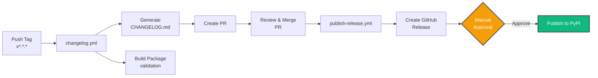

# Contributing to Yohou-Optuna

Thank you for your interest in contributing to Yohou-Optuna! This document provides guidelines for contributing to the project.

## Code of Conduct

We are committed to providing a welcoming and inclusive environment for all contributors. Please be respectful and considerate in all interactions.

## Getting Started

### Prerequisites

- Python 3.11+
- [uv](https://github.com/astral-sh/uv) (recommended)
- [just](https://github.com/casey/just) (optional, for task automation)
- Git

### Development Setup

1. Fork the repository on GitHub

2. Clone your fork:

```bash
git clone https://github.com/YOUR_USERNAME/yohou-optuna.git
cd yohou-optuna
```

3. Install dependencies:

```bash
uv sync --group dev
```

4. Install pre-commit hooks:

```bash
uv run pre-commit install
```

## Development Workflow

### Making Changes

1. Create a new branch:

```bash
git checkout -b feature/my-feature
```

2. Make your changes

3. Run tests:

=== "just"

    ```bash
    just test
    ```

=== "nox"

    ```bash
    uvx nox -s test
    ```

=== "uv run"

    ```bash
    uv run pytest
    ```

4. Format and fix code:

=== "just"

    ```bash
    just fix
    ```

=== "nox"

    ```bash
    uvx nox -s fix
    ```

=== "uv run"

    ```bash
    uv run ruff format src tests
    uv run ruff check src tests --fix
    uv run ty check src
    ```

5. Commit your changes:

```bash
git add .
git commit -m "feat: add my feature"
```

We follow [Conventional Commits](https://www.conventionalcommits.org/) for commit messages. The commit message format is enforced by commitizen pre-commit hooks, which will validate your commit messages automatically.

**Valid commit message examples:**

- `feat: add new feature`
- `fix: resolve bug in calculation`
- `docs: update installation guide`
- `chore: update dependencies`
- `test: add tests for new feature`

### Running Tests

Yohou-Optuna uses pytest with markers to categorize tests into different types:

- **Fast tests**: Unit tests that run quickly without subprocess calls or heavy I/O
- **Slow tests**: Tests marked with `@pytest.mark.slow` that take longer to execute
- **Integration tests**: Tests marked with `@pytest.mark.integration` that run subprocesses or test multiple components together

#### Test Commands

Run fast tests only (recommended during development):

=== "just"

    ```bash
    just test-fast
    ```

=== "nox"

    ```bash
    uvx nox -s test_fast
    ```

=== "uv run"

    ```bash
    uv run pytest -m "not slow and not integration"
    ```

Run slow and integration tests:

=== "just"

    ```bash
    just test-slow
    ```

=== "nox"

    ```bash
    uvx nox -s test_slow
    ```

=== "uv run"

    ```bash
    uv run pytest -m "slow or integration"
    ```

Run all tests:

=== "just"

    ```bash
    just test
    ```

=== "nox"

    ```bash
    uvx nox -s test
    ```

=== "uv run"

    ```bash
    uv run pytest
    ```

Run tests with coverage:

=== "just"

    ```bash
    just test-cov
    ```

=== "nox"

    ```bash
    uvx nox -s test_coverage
    ```

=== "uv run"

    ```bash
    uv run pytest --cov=yohou_optuna --cov-report=html
    ```


Run tests across multiple Python versions:

=== "nox"

    ```bash
    uvx nox -s test
    ```

Run example notebook tests:

=== "just"

    ```bash
    just test-examples
    ```

=== "nox"

    ```bash
    uvx nox -s test_examples
    ```

=== "uv run"

    ```bash
    uv run pytest tests/test_examples.py -m example -n auto
    ```

This runs all notebooks in the `examples/` directory as Python scripts in parallel using pytest-xdist (`-n auto`). Each notebook is executed non-interactively to validate it runs without errors.


#### When to Mark Tests as Slow or Integration

Mark your tests appropriately to help maintain fast feedback during development:

- Use `@pytest.mark.slow` for tests that:
  - Take more than a few seconds to run
  - Perform heavy computations
  - Make network requests
  - Access external resources

- Use `@pytest.mark.integration` for tests that:
  - Run subprocess commands
  - Test multiple components working together
  - Require complex setup or teardown
  - Exercise end-to-end workflows

- `@pytest.mark.example` is used in `tests/test_examples.py` to:
  - Validate example notebooks execute without errors
  - Run notebooks in the `examples/` directory
  - Test interactive documentation and tutorials


Example:

```python
import pytest

@pytest.mark.slow
def test_large_computation():
    # Long-running test
    pass

@pytest.mark.integration
@pytest.mark.slow
def test_end_to_end_workflow():
    # Complex integration test
    pass
```

#### Test Organization

Follow these conventions when writing tests:

**Class-based test structure**: Group related tests into classes using the `Test<Component><Scenario>` naming pattern.

**Fixture usage**: Prefer fixtures from `conftest.py` over module-level data. See `tests/conftest.py` for available factories.

**Property-based testing**: [Hypothesis](https://hypothesis.readthedocs.io/) is available for property-based testing of edge cases and invariants.

#### CI Test Strategy

The CI pipeline uses a two-tier testing strategy optimized for fast feedback:

1. **Fast tests** (`test-fast` job): Runs on minimum and maximum Python versions (3.11, 3.14) only:
   - **Draft PRs**: Ubuntu only, giving quick feedback in ~2-3 minutes
   - **Ready PRs/Main**: all OS (Ubuntu, Windows, macOS) for cross-platform validation

2. **Full test suite** (`test-full` job): Runs all tests (fast + slow + integration) on Ubuntu across all Python versions (3.11-3.14) when the PR is not in draft mode or on the main branch. This comprehensive validation includes coverage reporting on the minimum supported Python version.

### Code Quality

Run linters and type checkers:

=== "just"

    ```bash
    just lint
    ```

=== "nox"

    ```bash
    uvx nox -s lint
    ```

=== "uv run"

    ```bash
    uv run ruff check src tests
    uv run ty check src
    ```

Format code and fix issues:

=== "just"

    ```bash
    just fix
    ```

=== "nox"

    ```bash
    uvx nox -s fix
    ```

=== "uv run"

    ```bash
    uv run ruff format src tests
    uv run ruff check src tests --fix
    uv run ty check src
    ```

Run all quality checks:

=== "just"

    ```bash
    just check
    ```

=== "uv run"

    ```bash
    just fix && just test
    ```

### Docstring Standards

All public functions, methods, and classes require **NumPy-style** docstrings. Coverage is enforced at 100% by `interrogate`.

**Check docstring coverage:**

```bash
uvx interrogate src
```

**Required sections** (as applicable):

- `Parameters`: all function/method parameters with types and descriptions
- `Returns`: return value type and description
- `Raises`: exceptions raised
- `See Also`: related classes/functions
- `References`: academic references for algorithms or methods used
- `Notes`: implementation details, mathematical background
- `Examples`: usage examples (tested via `pytest --doctest-modules`)

**`See Also` format:**

Use standard numpydoc format with short backtick names. The `mkdocs-autorefs` plugin automatically links backtick references (e.g., `` `ClassName` ``) to the corresponding API pages in rendered documentation. This means plain backtick-wrapped names in docstrings become clickable links in the docs site without any special syntax.

For hyperlinks, always use Markdown syntax: `[text](url)`.

### Documentation

Build documentation:

=== "just"

    ```bash
    just build
    ```

=== "nox"

    ```bash
    uvx nox -s build_docs
    ```

=== "uv run"

    ```bash
    uv run mkdocs build
    ```

Serve documentation locally:

=== "just"

    ```bash
    just serve
    ```

=== "nox"

    ```bash
    uvx nox -s serve_docs
    ```

=== "uv run"

    ```bash
    uv run mkdocs serve
    ```

View all available commands:

```bash
just --list
```

### Adding Examples

All examples are interactive [marimo](https://marimo.io) notebooks that combine code, markdown, and visualizations.

#### Creating a Notebook

Create a new marimo notebook in `examples/<name>.py`:

=== "just"

    ```bash
    just example <name>.py
    ```

=== "uv run"

    ```bash
    uv run marimo new examples/<name>.py
    ```

#### Required Structure

Notebooks serve **tutorials** or **how-to guides** only, never explanation or reference. The structure depends on the quadrant:

**Tutorial notebooks** (category: `tutorial`):

1. **Title**: `# In this notebook, we will [goal]`
2. **Prerequisites**: One-liner stating required prior knowledge
3. **Numbered sections**: `## 1. Section Name`, `## 2. Section Name`, etc. with visible output every cell
4. **What We Built**: Closing section summarizing what was accomplished and linking to next steps

**How-to notebooks** (category: `how-to`):

1. **Title**: `# How to [Verb] [Object]`
2. **Prerequisites**: One-liner stating required prior knowledge
3. **Numbered sections**: `## 1. Section Name`, `## 2. Section Name`, etc. with action-only prose
4. No closing summary; the notebook ends after the last step

**Example intro cell (tutorial)**:

```markdown
# Your First Hyperparameter Search

In this notebook, we will run a hyperparameter search using OptunaSearchCV
and inspect the results.

**Prerequisites:** Python 3.11+ and familiarity with Scikit-Learn's fit/predict API.
```

**Example intro cell (how-to)**:

```markdown
# How to Stop Optimization Early with Callbacks

This notebook shows how to attach Optuna callbacks to OptunaSearchCV
to stop a search after a fixed number of trials.

**Prerequisites:** Familiarity with the
OptunaSearchCV quickstart
([View](/examples/quickstart/) · [Open in marimo](/examples/quickstart/edit/)).
```

#### Marimo Cell Conventions

- Use `hide_code=True` on all markdown cells, import cells, and utility/helper cells
- Use `r"""..."""` (raw triple-quoted strings) for markdown cell content
- All notebooks declare dependencies using [PEP 723](https://peps.python.org/pep-0723/) inline script metadata at the top of the file:

    ```python
    # /// script
    # requires-python = ">=3.11"
    # dependencies = [
    #     "plotly",
    #     "scikit-learn",
    # ]
    # ///
    ```

- Dependencies are sorted alphabetically and only list third-party packages actually imported by the notebook.
- `marimo` itself is NOT listed as a dependency (it is the runner, not a dependency of the script).
- To add a dependency: `uv add --script notebook.py <package>` or edit the header manually.
- To run in an isolated sandbox: `uv run marimo edit --sandbox notebook.py`.
- Group all imports into a single hidden cell after the metadata header

#### Content Guidelines

- **Gallery metadata**: Every example notebook should include a `__gallery__` variable defining `title`, `description`, and `category` (`"tutorial"` or `"how-to"`) for the example gallery. Add a `companion` key pointing to the matching doc page path when one exists.
- **Markdown density**: Each numbered section should open with a short markdown cell (one to two sentences) before any code cells. Tutorial sections may be slightly longer; how-to sections should be action-only.
- **No emojis**: Do not use emojis anywhere in notebooks whether it is in headings, content bullets, or concluding remarks.
- **API cross-links**: When mentioning yohou_optuna classes or functions in markdown cells, wrap them in backtick-link syntax pointing to the API page.
- **Voice**: Tutorials use "we" (first-person plural). How-to guides use imperative or conditional imperatives ("If you need X, pass Y").

#### Testing and Documentation

Run the example test suite to verify your notebook passes:

=== "just"

    ```bash
    just test-examples
    ```

=== "nox"

    ```bash
    uvx nox -s test_examples
    ```

=== "uv run"

    ```bash
    uv run pytest tests/test_examples.py -m example
    ```

Add a link to your example in `docs/pages/tutorials/examples.md`:

```markdown
- [Example Name](../examples/<name>/): brief description
```

The mkdocs hooks automatically export notebooks to HTML during docs build. All notebooks in `examples/` are automatically discovered and tested by `test_examples.py` using pytest's parametrization feature, which runs them in parallel for fast validation.

## Before You Open a PR

- [ ] Run `just test-fast`: all fast tests pass
- [ ] Run `just fix`: code is formatted and linted
- [ ] Write or update tests for your changes
- [ ] If you changed docs, run `just serve` and verify they render
- [ ] Use conventional commit messages
- [ ] Keep the PR focused on a single concern

## Submitting Changes

1. Push your changes to your fork:

```bash
git push origin feature/my-feature
```

2. Open a Pull Request on GitHub

3. Ensure all CI checks pass

4. Wait for review and address any feedback

## Pull Request Guidelines

- Write clear, descriptive PR titles following Conventional Commits
- Include a description of the changes
- Add tests for new functionality
- Update documentation as needed
- Ensure all tests pass
- Keep PRs focused and atomic

## Commit Message Convention

We use [Conventional Commits](https://www.conventionalcommits.org/) enforced by commitizen:

- `feat:`: new features (triggers minor version bump)
- `fix:`: bug fixes (triggers patch version bump)
- `docs:`: documentation changes
- `style:`: code style changes (formatting, etc.)
- `refactor:`: code refactoring
- `test:`: adding or updating tests
- `chore:`: maintenance tasks
- `perf:`: performance improvements
- `ci:`: CI/CD changes

**Breaking changes:** Add `!` after the type or add `BREAKING CHANGE:` in the footer to trigger a major version bump.

**Example with scope:**
```bash
git commit -m "feat(api): add new endpoint for user data"
```

**Example with breaking change:**
```bash
git commit -m "feat!: redesign authentication system

BREAKING CHANGE: authentication now requires API keys instead of passwords"
```

The pre-commit hook will validate your commit messages and prevent commits that don't follow the convention.

## Release Process

!!! note "Maintainers only"
    The release process is managed by project maintainers. Contributors do not need to create releases. Open PRs and a maintainer will handle versioning and publishing.

Releases are fully automated through GitHub Actions when a new tag is pushed, with a **manual approval gate** before publishing to PyPI to ensure quality control.



### How It Works

1. **Tag a release:**

    ```bash
   git tag v0.2.0 -m "Release v0.2.0"
   git push origin v0.2.0
    ```

2. **Automated changelog workflow** (`changelog.yml`):
   - Generates changelog from conventional commits using git-cliff
   - Creates a **Pull Request** with the updated CHANGELOG.md
   - Builds the package distributions (wheels and sdist) for **immediate validation**
   - Stores distributions as workflow artifacts (reused later to avoid rebuilding)

3. **Review and merge the changelog PR:**
   - A maintainer reviews the generated changelog
   - Once approved, merge the PR to main

4. **Automated release workflow** (`publish-release.yml`):
   - Creates a GitHub Release with generated release notes
   - Attaches distribution files to the release
   - **Waits for manual approval** before proceeding to PyPI

5. **Manual approval for PyPI publishing:**
   - Designated reviewers receive a notification
   - Review the GitHub Release to verify everything is correct
   - Approve the deployment to publish to PyPI
   - Package is published using Trusted Publishing (OIDC, no tokens needed)

6. **Release notes generation:**
   - All commits since the last tag are analyzed
   - Commits are grouped by type (Added, Fixed, Documentation, etc.)
   - Only commits following conventional format are included
   - Breaking changes are highlighted

### Version Numbering

This project uses [Semantic Versioning](https://semver.org/):

- **Major** (1.0.0): Breaking changes
- **Minor** (0.1.0): New features (backward compatible)
- **Patch** (0.0.1): Bug fixes (backward compatible)

Use conventional commits to communicate the type of change, and select the appropriate version number when tagging.

## Questions?

If you have any questions, feel free to:

- [Open an issue on GitHub](https://github.com/stateful-y/yohou-optuna/issues/new)
- [Start a discussion in the repository](https://github.com/stateful-y/yohou-optuna/discussions)

Thank you for contributing!
